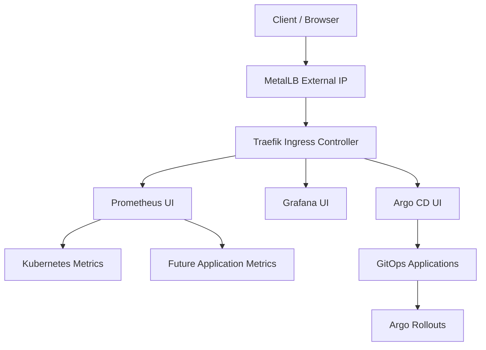

# Enterprise Progressive Delivery Platform

## Overview

This repository demonstrates a production-style Progressive Delivery platform on Kubernetes.

The project is designed to show how modern platform teams reduce release risk by combining GitOps, progressive delivery, observability, and automated rollback.

## Phase 1 Status: Platform Bootstrap

Completed platform components:

- Kubernetes
- MetalLB
- Traefik
- Argo CD
- Argo Rollouts
- Prometheus
- Grafana

## Platform Architecture

## Phase 1 Design Summary

- MetalLB provides a fixed external IP for the Kubernetes cluster.
- Traefik is the single ingress entry point.
- Applications are exposed through host-based routing.
- Argo CD will manage the application lifecycle through GitOps.
- Argo Rollouts will manage progressive delivery strategies.
- Prometheus and Grafana provide observability and release analysis data.

## Next Phase

Phase 2 will introduce:

- Demo application
- Container image build pipeline
- GitOps application manifests
- Canary Rollout
- Prometheus AnalysisTemplate
- Automated rollback
- Failure injection scenarios
