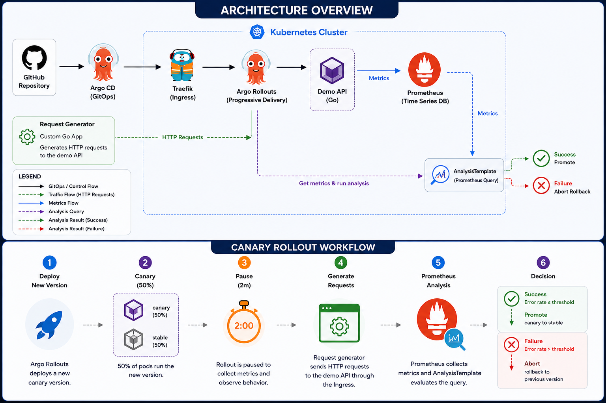

# Progressive Delivery using Argo Rollouts

A production-inspired lab demonstrating Progressive Delivery on Kubernetes using **Argo Rollouts**, **Argo CD**, **Prometheus Operator**, and **Traefik**.

The project shows how a canary deployment can be automatically promoted or aborted based on real application metrics collected by Prometheus.

---

## Features

- GitOps deployment with Argo CD
- Canary deployment using Argo Rollouts
- Canary without Traffic Management
- Prometheus-based rollout analysis
- Automatic rollout abort on high error rate
- Demo application written in Go
- Configurable healthy/unhealthy application profiles
- Custom Prometheus metrics
- Request generator for traffic simulation

---

## Architecture

```text
GitHub
    │
    ▼
Argo CD
    │
    ▼
Argo Rollouts
    │
    ▼
Demo Application
    │
    ▼
Prometheus
    │
    ▼
AnalysisTemplate
    │
    ▼
Promote / Abort
```

---

## Progressive Delivery Workflow

```text
Deploy New Version
        │
        ▼
Canary (50%)
        │
        ▼
Pause (2 minutes)
        │
        ▼
Generate Traffic
        │
        ▼
Prometheus collects metrics
        │
        ▼
AnalysisTemplate evaluates error rate
        │
   ┌────┴────┐
   │         │
Success    Failure
   │         │
   ▼         ▼
Promote    Abort
```

---

## Repository Structure

```text
.
├── apps/
│   └── demo-api
├── argo-cd/
├── manifests/
├── docs/
│   ├── architecture/
│   ├── application/
│   ├── platform/
│   ├── rollout/
│   └── testing/
└── scripts/
```

---

## Technologies

| Category | Technology |
|-----------|------------|
| Container Orchestration | Kubernetes |
| GitOps | Argo CD |
| Progressive Delivery | Argo Rollouts |
| Ingress | Traefik |
| Monitoring | kube-prometheus-stack |
| Metrics | Prometheus |
| Application | Go |
| Container Registry | GitHub Container Registry |

---

## Monitoring

The demo application exposes custom Prometheus metrics through `/metrics`.

The rollout analysis evaluates the percentage of HTTP 5xx responses using the following query:

```promql
(
  sum(rate(demo_api_http_requests_total{status=~"5.."}[2m]))
/
  sum(rate(demo_api_http_requests_total[2m]))
) * 100
```

If the calculated error rate exceeds the configured threshold, Argo Rollouts automatically aborts the deployment.

---

## Demo Scenarios

### Healthy Release

- Deploy new version
- Generate traffic
- Prometheus analysis succeeds
- Rollout is promoted

### Unhealthy Release

- Deploy new version
- Generate traffic
- Error rate exceeds threshold
- Analysis fails
- Rollout is automatically aborted

---

## Documentation

Detailed documentation is available under the `docs/` directory.

- Architecture
- Platform setup
- Demo application
- Canary rollout
- Prometheus analysis
- Abort scenario
- Traffic simulation

---

## Roadmap

- [x] GitOps with Argo CD
- [x] Canary deployment
- [x] Prometheus analysis
- [x] Automatic abort
- [ ] Canary with Traffic Management
- [ ] Notifications
- [ ] Experiment Rollouts
- [ ] Background Analysis

---