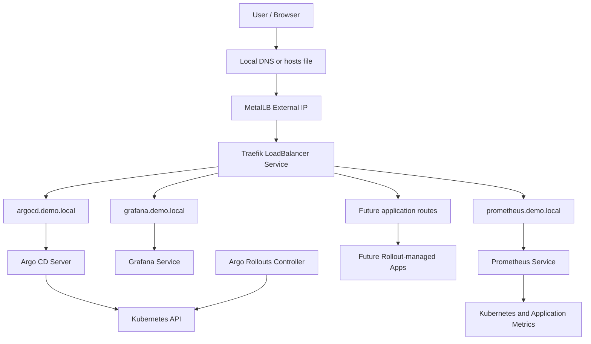

# Platform Architecture Overview

## Goal

Phase 1 prepares the base platform required for a production-style Progressive Delivery lab.

The purpose of this phase is not to demonstrate a simple application deployment. Instead, it establishes the operational foundation required for GitOps, ingress routing, observability, and automated delivery control.

## Architecture

## Key Design Decisions

### Single External IP

A single MetalLB IP is assigned to Traefik. All HTTP and HTTPS traffic enters the cluster through Traefik.

This avoids assigning a separate external IP to every internal platform service.

### Host-Based Routing

Different services are exposed using different hostnames:

- `argocd.demo.local`
- `grafana.demo.local`
- `prometheus.demo.local`
- future application domains

Traefik routes traffic based on the `Host` header.

### Application-Owned Routes

Routes are defined close to the application namespace. For example, the Argo CD route belongs in the `argocd` namespace rather than the `traefik` namespace.

This keeps ownership clear and matches GitOps-friendly repository organization.
