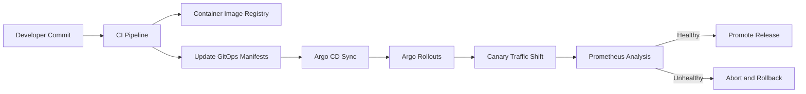

# Release Flow

## Target Release Flow for Phase 2

## Purpose

Phase 1 only prepares the platform. Phase 2 will implement this release flow with a demo application and measurable failure scenarios.
