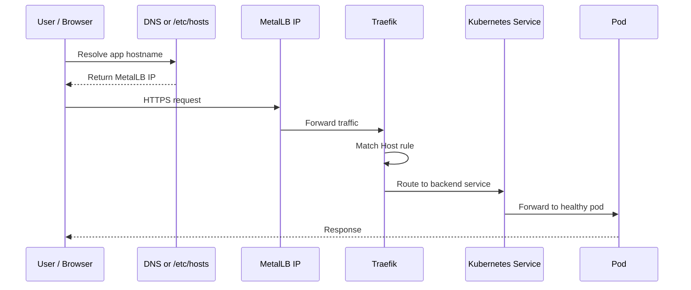

# Traffic Flow

## External Access Flow

```mermaid
sequenceDiagram
    participant User as User / Browser
    participant DNS as DNS or /etc/hosts
    participant MetalLB as MetalLB IP
    participant Traefik as Traefik
    participant Service as Kubernetes Service
    participant Pod as Pod

    User->>DNS: Resolve app hostname
    DNS-->>User: Return MetalLB IP
    User->>MetalLB: HTTPS request
    MetalLB->>Traefik: Forward traffic
    Traefik->>Traefik: Match Host rule
    Traefik->>Service: Route to backend service
    Service->>Pod: Forward to healthy pod
    Pod-->>User: Response
```

## Notes

Traefik is the only public HTTP/HTTPS entry point in the cluster. Platform services and future applications are exposed through Traefik routes.
