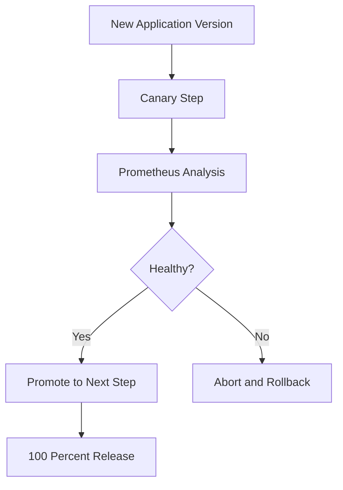

# Argo Rollouts

## Purpose

Argo Rollouts is the Progressive Delivery controller for Kubernetes.

It extends the standard Kubernetes Deployment model with advanced release strategies.

## Role in This Project

In Phase 2, Argo Rollouts will manage the demo application release process.

Planned release capabilities:

- Canary rollout
- Step-based traffic exposure
- Prometheus-based analysis
- Automated promotion
- Automated rollback

## Deployment vs Release

Deployment means the new version exists in the environment.

Release means users are gradually exposed to that version.

This project focuses on release control, not just deployment automation.

## Target Rollout Flow

## Why This Matters

In production environments, the main risk is not whether a deployment can be applied. The main risk is whether the new version behaves safely under real traffic.

Argo Rollouts helps control that risk.
