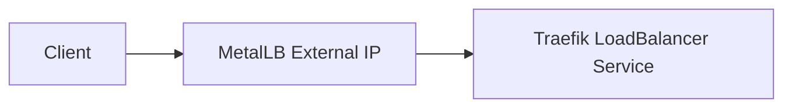

# MetalLB

## Purpose

MetalLB provides external IP addresses for Kubernetes `LoadBalancer` Services in bare-metal environments.

In managed Kubernetes environments, cloud providers usually assign external LoadBalancer IPs. In a bare-metal lab, MetalLB fills that gap.

## Role in This Project

MetalLB exposes Traefik through a stable external IP.

## Design Decisions

### One IP for Traefik

The project uses one external IP for Traefik instead of assigning separate IPs to every service.

This keeps the platform simple and closer to real-world ingress architecture.

### Host-Based Routing

Multiple hostnames can point to the same MetalLB IP:

- `argocd.demo.local`
- `grafana.demo.local`
- `prometheus.demo.local`
- future application hosts

Traefik decides where to send traffic based on the hostname.

## Why This Matters

This design keeps network exposure centralized and makes Traefik the single HTTP/HTTPS entry point for the cluster.
