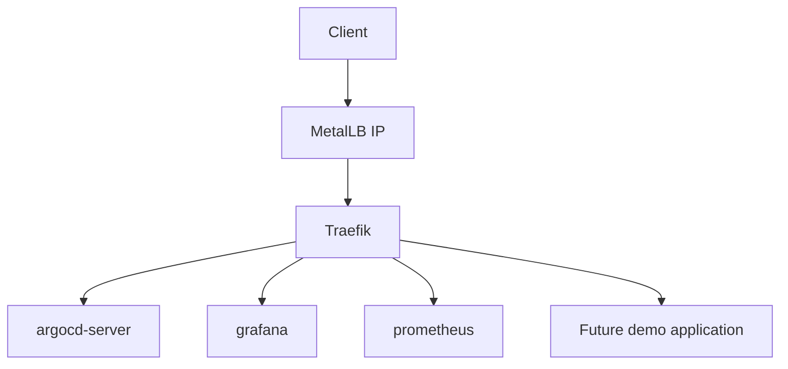

# Traefik

## Purpose

Traefik is the Kubernetes ingress controller for this platform.

It acts as the edge reverse proxy for HTTP and HTTPS traffic entering the cluster.

## Role in This Project

Traefik receives external traffic from the MetalLB IP and routes it to internal Kubernetes services.



## Responsibilities

- Ingress routing
- TLS termination
- Host-based routing
- Middleware support
- Access logs
- Prometheus metrics

## Why Traefik Instead of ingress-nginx?

The project intentionally uses Traefik instead of relying on the retired Kubernetes ingress-nginx project.

Traefik also provides a clean Kubernetes-native model through CRDs such as `IngressRoute` and `Middleware`.

## Routing Model

Routes are defined with Traefik `IngressRoute` resources.

Each application owns its own route in its namespace.

Example ownership model:

```text
argocd namespace
├── argocd-server Service
└── argocd IngressRoute
```

Traefik runs in its own namespace but watches route resources across namespaces.
