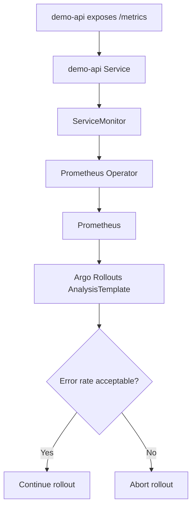

# Prometheus Analysis

## Purpose

Argo Rollouts uses an AnalysisTemplate to query Prometheus during the canary process.

Prometheus does not make rollout decisions. It stores metrics. Argo Rollouts queries Prometheus and decides whether the rollout should continue or fail.

## Flow



## Error Rate Query

The final query used in this lab calculates the percentage of HTTP 5xx responses over the total request rate during the last two minutes.

```promql
(
  sum(rate(demo_api_http_requests_total{status=~"5.."}[2m]))
/
  sum(rate(demo_api_http_requests_total[2m]))
) * 100
```

## Success Condition

```yaml
successCondition: result[0] < 30
```

This means:

```text
error rate < 30%  -> analysis succeeds
error rate >= 30% -> analysis fails
```

## Why the Rollout Pauses Before Analysis

The rollout pauses before running analysis so the request generator can produce traffic and Prometheus can collect enough samples.
