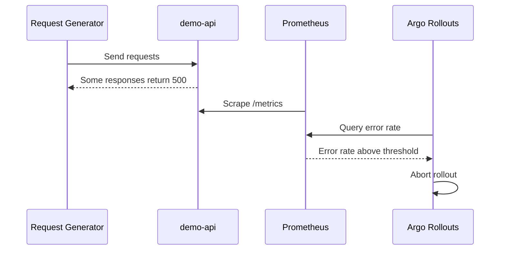

# Abort Scenario

## Purpose

This scenario demonstrates automatic rollout abort based on application metrics.

The demo application can intentionally generate failures using the `unhealthy-app` ConfigMap.

## Failure Configuration

```yaml
APP_HEALTH: unhealthy
APP_FAILURE_RATE: "70"
```

This means the application behaves as unhealthy and returns HTTP 500 for approximately 70 percent of requests.

## Expected Result

1. Argo Rollouts shifts part of the workload to the canary version.
2. The rollout pauses for two minutes.
3. The request generator sends traffic to the application.
4. Prometheus scrapes application metrics from `/metrics`.
5. Argo Rollouts runs the AnalysisTemplate.
6. The calculated error rate exceeds the configured threshold.
7. The analysis fails.
8. The rollout is aborted.

## Flow



## Operational Value

This scenario shows how a problematic release can be stopped automatically before it is fully promoted.
